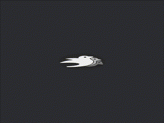

# Bevy Custom Render Pipeline Example

Example for my talk 'Hooking into the Bevy Rendering Pipeline'

@ [Bevy Meetup](https://www.meetup.com/bevy-game-development)

Output: 2D Mesh with a a texture and a vertex animation

The slides are on [github pages](https://lommix.github.io/bevy_pipeline_talk_slides)
